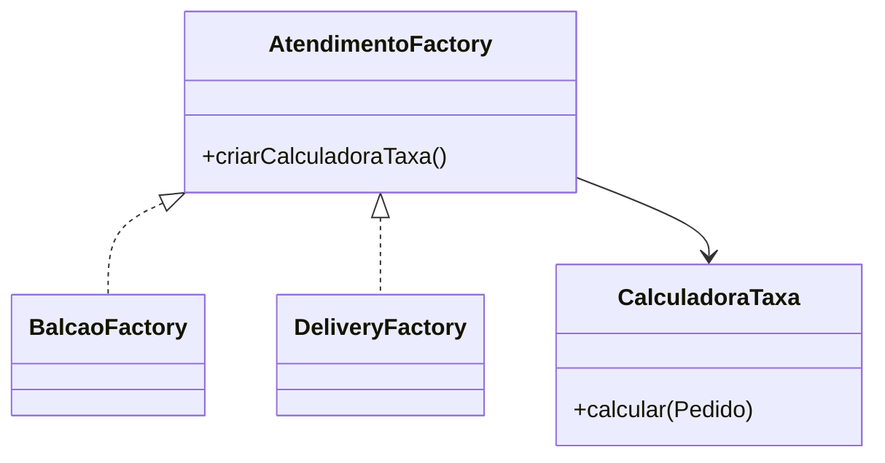
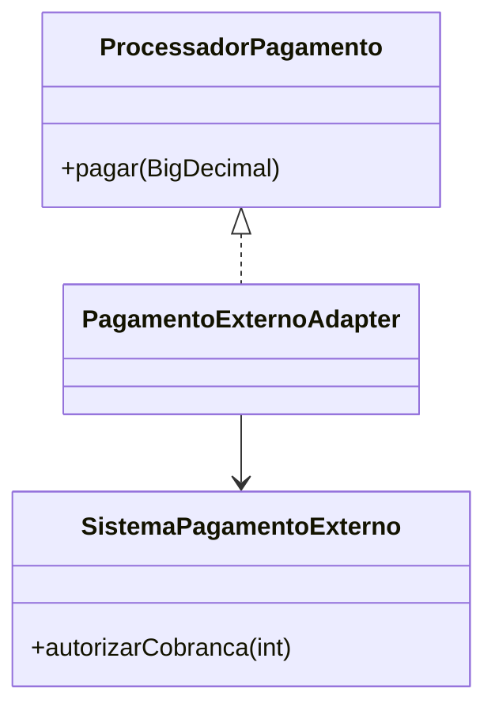
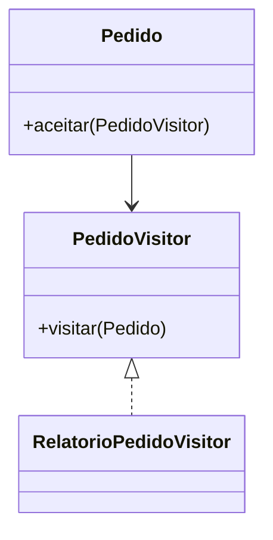

# Documento Arquitetural

## Visão Geral

O sistema representa um restaurante que recebe pedidos por mesa. O protótipo não usa tela nem banco de dados, pois o foco do trabalho é arquitetura, qualidade e testes.

## Organização

- `dominio`: classes principais, como `Mesa`, `Pedido`, `ItemCardapio` e `Funcionario`.
- `servico`: regras de aplicação, como cardápio, autenticação, cozinha, conta e garçom.
- `factory`: aplicação do padrão `Abstract Factory`.
- `adapter`: aplicação do padrão `Adapter`.
- `visitor`: aplicação do padrão `Visitor`.

## Padrão Abstract Factory

Problema: o sistema pode ter regras diferentes para cada tipo de atendimento, como balcão e delivery.

Solução: foi criada a interface `AtendimentoFactory`, com fábricas como `BalcaoFactory` e `DeliveryFactory`.

Justificativa: o código principal não precisa conhecer detalhes da taxa de cada atendimento.

Impacto: novas regras de atendimento podem ser adicionadas criando novas fábricas.

Limitação: para um protótipo pequeno, o padrão deixa a estrutura um pouco maior.

## Padrão Adapter

Problema: o sistema trabalha com valores em reais, mas o serviço externo simulado recebe valores em centavos e retorna texto.

Solução: `PagamentoExternoAdapter` converte o valor e traduz a resposta para verdadeiro ou falso.

Justificativa: a regra interna de pagamento fica protegida do formato externo.

Impacto: o sistema pode trocar a integração externa com menos alteração nas classes de domínio.

Limitação: o adaptador depende do contrato mínimo do serviço externo.

## Padrão Visitor

Problema: relatórios de pedidos podem crescer sem que a classe `Pedido` precise receber várias regras novas.

Solução: `PedidoVisitor` define uma operação externa, e `RelatorioPedidoVisitor` calcula quantidade por item e faturamento.

Justificativa: o relatório fica separado do domínio principal.

Impacto: novas operações de leitura podem ser criadas sem alterar muito a classe `Pedido`.

Limitação: quando o domínio muda bastante, os Visitors também precisam ser revisados.

## Observação

O protótipo atende ao enunciado por meio de classes simples, testes unitários, stubs, mock com Mockito, JavaDoc e documentação. Requisitos de interface e disponibilidade foram representados como verificações simuladas, pois o PDF informa que interface gráfica e banco de dados não são o foco da avaliação.
